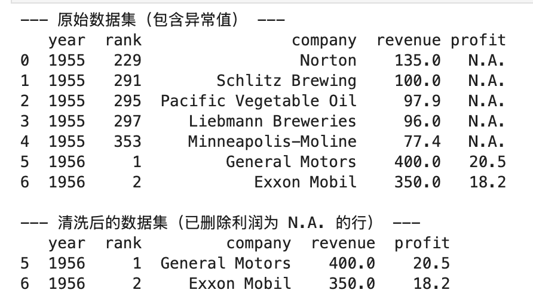
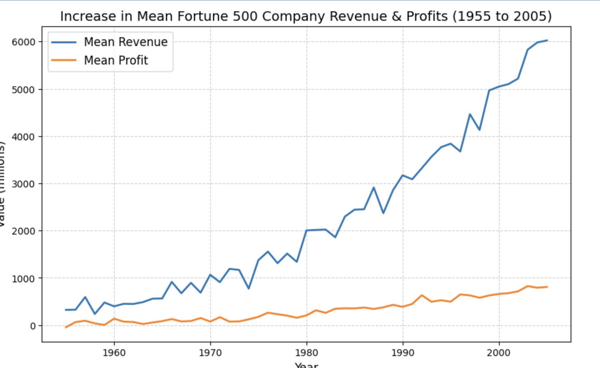

# Jupyter Notebook 基础实践 (Fujian Normal University)

## 📌 实验目的
* [cite_start]进一步熟悉 Python 的核心语法 [cite: 10]。
* [cite_start]熟练掌握 Notebook 开发的基本流程与常用快捷键 [cite: 11, 29]。
* [cite_start]掌握 Notebook 中 Cell 的两种模式（Edit 和 Command）及 Kernel 的基本概念 [cite: 30, 31]。
* [cite_start]熟悉 Python 数据分析（Pandas）与数据可视化（Matplotlib）常用库的用法 [cite: 12, 42, 51]。

---

## 🛠️ 环境准备与安装
[cite_start]建议采用 **Anaconda** 方式安装完整的 Python 科学计算环境 [cite: 21]。

1. 下载并安装 [Anaconda](https://www.anaconda.com/)。
2. 启动 Jupyter Notebook：
   ```bash
   jupyter notebook

```

---

## 🚀 实验内容与代码实现

### 1. Python 基础语法：选择排序算法 (Selection Sort)

* 
**功能描述**：定义 `selection_sort` 函数执行选择排序的核心逻辑；定义 `test` 函数实现动态数据输入，捕获异常输入并输出排序前后的结果 。


* **代码逻辑**：
```python
def selection_sort(arr):
    """选择排序算法"""
    n = len(arr)
    for i in range(n):
        min_idx = i
        for j in range(i + 1, n):
            if arr[j] < arr[min_idx]:
                min_idx = j
        arr[i], arr[min_idx] = arr[min_idx], arr[i]
    return arr

def test():
    """测试函数：执行数据输入，调用排序并输出结果"""
    input_str = input("请输入需要排序的数字（用空格隔开，例如: 64 25 12 22 11）：")
    try:
        data = [int(x) for x in input_str.split()]
        print("排序前的数组:", data)
        sorted_data = selection_sort(data)
        print("排序后的结果:", sorted_data)
    except ValueError:
        print("输入错误！请确保输入的全部是数字，并用空格隔开。")

```


### 2. 数据分析：财富500强数据集清洗 (Pandas)

* 
**功能描述**：使用 `Pandas` 库对财富500强排名数据集进行操作 。实验重点识别并清洗“利润(profit)”列中包含 `N.A.` 异常值的数据行，并将清洗后的属性转换为浮点型以供后续分析 。


* **数据操作流**：
```python
import pandas as pd

# [cite_start]模拟包含 N.A. 异常值的原始数据 [cite: 45]
df = pd.DataFrame(data_dict)

# 数据清洗：过滤掉 profit 列中为 "N.A." [cite_start]的行 [cite: 44]
df_clean = df[df['profit'] != 'N.A.'].copy()

# 类型转换
df_clean['profit'] = df_clean['profit'].astype(float)
df_clean['revenue'] = df_clean['revenue'].astype(float)

```


### 3. 数据图形绘制：利润与收入双折线图 (Matplotlib)

* 
**功能描述**：使用 `Matplotlib` 绘制 1955-2005 年财富500强企业的变化趋势图 。


* 
**进阶拓展**：大纲基础实验仅要求独立绘制利润，**本仓库已升级并实现了“在同一张图表内同时绘制利润(Profit)和收入(Revenue)”的复合指标对比图** 。


* **核心绘图代码**：
```python
import matplotlib.pyplot as plt

plt.figure(figsize=(10, 6))
# [cite_start]统一在同一张图内绘制两条曲线 [cite: 52]
plt.plot(df_trend['year'], df_trend['revenue'], label='Mean Revenue', color='#1f77b4', linewidth=2)
plt.plot(df_trend['year'], df_trend['profit'], label='Mean Profit', color='#ff7f0e', linewidth=2)

# 图表修饰
plt.title("Increase in Mean Fortune 500 Company Revenue & Profits (1955 to 2005)", fontsize=14)
plt.xlabel("Year", fontsize=12)
plt.ylabel("Value (millions)", fontsize=12)
plt.grid(True, linestyle='--', alpha=0.6)
plt.legend(fontsize=12)
plt.show()

```

### 4. 实验结果
- 1.


- 2.

- 3.


